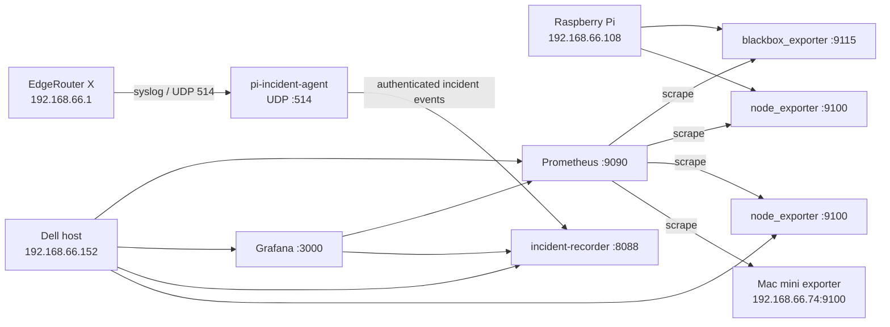

# home-obs

[中文说明](README.zh-CN.md)

Version-controlled configuration and source code for a small home observability stack. The repository captures the currently active Prometheus, Grafana, blackbox exporter, node exporter, syslog, and incident-recording setup while deliberately excluding credentials and runtime data.

## What this repository manages

| Node | Address | Role |
| --- | --- | --- |
| Dell host | `192.168.66.152` | Prometheus, Grafana, node exporter, and the central incident recorder |
| Raspberry Pi | `192.168.66.108` | Blackbox exporter, node exporter, EdgeRouter syslog receiver, and edge incident agent |
| EdgeRouter X | `192.168.66.1` | Home gateway; forwards `notice`-level syslog to the Raspberry Pi |
| Mac mini | `192.168.66.74` | Darwin node exporter target monitored by Prometheus |

The repository is a configuration backup and source of truth. Prometheus TSDB blocks, Grafana's database, incident SQLite databases, `.env` files, and SSH keys are runtime state and must be backed up separately.

## Architecture



Prometheus continuously records metrics. The Raspberry Pi performs active ICMP, TCP, HTTPS, and DNS probes. When a probe changes state, `pi-incident-agent` captures recent probe samples, Pi network state, EdgeRouter syslog, blackbox debug output, and optionally an EdgeRouter SSH snapshot. It then posts the event to the Dell incident recorder, which persists it in SQLite for the Grafana incident dashboard.

## Repository layout

```text
home-obs/
├── README.md
├── README.zh-CN.md
├── dell/
│   ├── .env.example
│   ├── docker-compose.yml
│   ├── prometheus/prometheus.yml
│   ├── grafana/
│   │   ├── provisioning/
│   │   └── dashboards/
│   ├── incident-recorder/
│   │   ├── recorder.py
│   │   └── test_recorder.py
│   └── nginx/grafana.zhoushicheng.cn.conf
└── rasp/
    ├── .env.example
    ├── docker-compose.yml
    ├── blackbox/blackbox.yml
    └── pi-incident-agent/
        ├── Dockerfile
        ├── agent.py
        ├── probes.json
        └── test_agent.py
```

## Prerequisites

- Docker Engine with Docker Compose
- Linux hosts with the addresses and routes referenced by the checked-in configuration, or equivalent local edits
- `NET_RAW` capability for blackbox ICMP probes
- UDP port `514` available on the Raspberry Pi
- An SSH key with read-only operational access to the EdgeRouter if router snapshots are enabled
- `jq` and Python 3.12 for local validation

The current Compose files intentionally mirror the running deployment and use `latest` image tags. Pin image versions before treating rebuilds as fully reproducible.

## Secrets and local state

Never commit real values. Start from the examples:

```bash
cp dell/.env.example dell/.env
cp rasp/.env.example rasp/.env
```

Set a strong Grafana password and generate one shared incident-ingest token:

```bash
openssl rand -base64 36
```

Use the generated token as `PI_INGEST_TOKEN` in both `.env` files. If EdgeRouter SSH snapshots are enabled, place the private key at:

```text
rasp/data/pi-incident-agent/erx_ssh_key
```

and restrict it to the container owner:

```bash
chmod 600 rasp/data/pi-incident-agent/erx_ssh_key
```

The root `.gitignore` excludes `.env`, all `data/` directories, SQLite databases, backup files, `known_hosts`, and SSH private-key patterns.

## Deploy the Dell services

```bash
cd dell
cp .env.example .env
mkdir -p data/incidents
# Fill in .env before continuing.
docker compose config -q
docker compose pull
docker compose up -d
docker compose ps
```

Services exposed by the current Compose file:

- Grafana: `http://192.168.66.152:3000`
- Prometheus: `http://192.168.66.152:9090`
- Incident receiver/analyzer: `http://192.168.66.152:8088`
- Node exporter: `http://192.168.66.152:9100/metrics`

The checked-in nginx file is a deployment sample. On the inspected host it was stored with the project but was not enabled in `/etc/nginx`; review its domain names, certificate paths, and authentication boundary before installing it.

## Deploy the Raspberry Pi services

Deploy the Dell incident receiver first so edge events have a destination.

```bash
cd rasp
cp .env.example .env
mkdir -p data/pi-incident-agent
# Fill in .env and install the optional EdgeRouter key before continuing.
docker compose config -q
docker compose build pi-incident-agent
docker compose pull blackbox node-exporter
docker compose up -d
docker compose ps
```

Services exposed on the Pi host network:

- Blackbox exporter: `http://192.168.66.108:9115`
- Node exporter: `http://192.168.66.108:9100/metrics`
- EdgeRouter syslog ingest: UDP `192.168.66.108:514`

The EdgeRouter currently forwards logs with the equivalent configuration:

```text
set system syslog host 192.168.66.108 facility all level notice
```

Do not commit a complete router configuration: it may contain password hashes, VPN keys, community strings, or other credentials.

## Validation

Validate Compose rendering after creating local `.env` files:

```bash
(cd dell && docker compose config -q)
(cd rasp && docker compose config -q)
```

Validate Prometheus and blackbox configuration with the deployed containers:

```bash
docker exec prometheus promtool check config /etc/prometheus/prometheus.yml
docker exec blackbox /bin/blackbox_exporter \
  --config.check \
  --config.file=/etc/blackbox_exporter/config.yml
```

Validate dashboard JSON:

```bash
for file in dell/grafana/dashboards/*.json; do jq empty "$file"; done
```

Run the standard-library unit tests:

```bash
(cd rasp/pi-incident-agent && python -m unittest -v test_agent.py)
(cd dell/incident-recorder && python -m unittest -v test_recorder.py)
```

## Grafana dashboard workflow

Dashboards are provisioned from `dell/grafana/dashboards`. Their stable UIDs are checked into JSON. The current provider allows UI updates, so a dashboard can drift from Git:

1. Edit the dashboard in Grafana.
2. Export the dashboard JSON.
3. Replace the matching JSON file in this repository.
4. Review the diff and commit it.

File provisioning wins when Grafana reloads the checked-in dashboard, so do not leave important changes only in the Grafana database.

## Data retention and backups

Git backs up configuration, not telemetry. Back up these locations independently if their history matters:

- Dell named volumes: `prometheus-data` and `grafana-data`
- Dell bind mount: `dell/data/incidents/`
- Pi bind mount: `rasp/data/pi-incident-agent/`
- Both hosts' real `.env` files and the EdgeRouter SSH key, using an encrypted secrets backup

The inspected deployment currently stores large diagnostic payloads in both the Pi outbox and the Dell evidence database without a cleanup policy. Each database had grown to roughly 1 GB. Add retention before relying on this stack for long-term unattended operation.

## Security notes

- Keep this repository private even though secrets are excluded; it documents internal addresses and topology.
- Rotate any credentials that have ever been pasted into terminals, tickets, or chat.
- Restrict ports `3000`, `8088`, `9090`, `9100`, and `9115` to the LAN or VPN.
- Keep `REQUIRE_GRAFANA_AUTH=true` unless another trusted authentication layer protects the analysis endpoint.
- Use a dedicated, restricted EdgeRouter SSH key.
- Review image updates intentionally; avoid unattended `latest` upgrades for a recovery-critical deployment.

## Current known issues

- Delivered Pi outbox payloads and Dell incident evidence have no retention policy.
- Some timeout incidents are classified as `failure_layer=dns`; the diagnostic classifier should be reviewed.
- Grafana dashboards and datasources are editable in the UI and can drift from Git.
- Upstream container images are not yet pinned to immutable versions or digests.
- The Dell root filesystem was at 91% usage during the initial inventory; monitoring storage should be watched closely.
