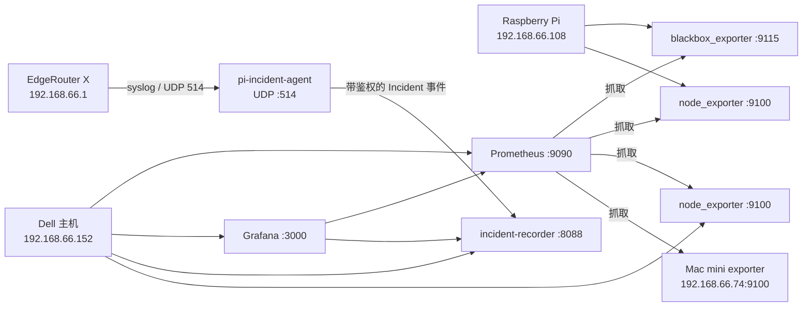

# home-obs

[English](README.md)

这是一套家庭可观测性系统的配置与源码仓库，用于保存当前生效的 Prometheus、Grafana、blackbox exporter、node exporter、syslog 和 Incident 记录方案。仓库只保存可重建的配置与代码，明确排除密码、Token、私钥和运行数据。

## 管理范围

| 节点 | 地址 | 职责 |
| --- | --- | --- |
| Dell 主机 | `192.168.66.152` | Prometheus、Grafana、node exporter、中央 Incident recorder |
| Raspberry Pi | `192.168.66.108` | blackbox exporter、node exporter、EdgeRouter syslog 接收、边缘 Incident agent |
| EdgeRouter X | `192.168.66.1` | 家庭网关，把 `notice` 级 syslog 转发到树莓派 |
| Mac mini | `192.168.66.74` | 被 Prometheus 抓取的 Darwin node exporter 节点 |

该仓库是配置备份和事实来源，不是监控数据备份。Prometheus TSDB、Grafana 数据库、Incident SQLite、`.env` 与 SSH 私钥必须单独备份。

## 架构



Prometheus 持续保存指标；树莓派执行 ICMP、TCP、HTTPS 与 DNS 主动拨测。拨测状态变化时，`pi-incident-agent` 会收集最近的拨测样本、Pi 网络状态、EdgeRouter syslog、blackbox debug，并可选地通过 SSH 获取 EdgeRouter 快照，然后把事件发送给 Dell。Dell 上的 recorder 将事件写入 SQLite，供 Grafana Incident 看板查询。

## 目录结构

```text
home-obs/
├── README.md                 # 默认英文文档
├── README.zh-CN.md           # 中文文档
├── dell/
│   ├── .env.example
│   ├── docker-compose.yml
│   ├── prometheus/prometheus.yml
│   ├── grafana/provisioning/
│   ├── grafana/dashboards/
│   ├── incident-recorder/
│   └── nginx/
└── rasp/
    ├── .env.example
    ├── docker-compose.yml
    ├── blackbox/blackbox.yml
    └── pi-incident-agent/
```

## 前置条件

- Docker Engine 与 Docker Compose
- Linux 主机网络与仓库配置中的地址一致，或先按实际网络修改配置
- blackbox ICMP 所需的 `NET_RAW` capability
- 树莓派 UDP `514` 端口可用
- 如需路由器诊断快照，需要一把权限受限的 EdgeRouter SSH 私钥
- 本地验证建议安装 `jq` 与 Python 3.12

目前 Compose 仍使用 `latest` 镜像标签，这是对现网的忠实保存，但还不能保证未来重建得到完全相同的版本。建议后续固定镜像版本或 digest。

## 密钥与本地数据

先复制环境变量模板：

```bash
cp dell/.env.example dell/.env
cp rasp/.env.example rasp/.env
```

设置强 Grafana 密码，并生成两台主机共用的 Incident ingest Token：

```bash
openssl rand -base64 36
```

将同一个值填入两份 `.env` 的 `PI_INGEST_TOKEN`。如果启用 EdgeRouter SSH 快照，把私钥放在：

```text
rasp/data/pi-incident-agent/erx_ssh_key
```

并设置权限：

```bash
chmod 600 rasp/data/pi-incident-agent/erx_ssh_key
```

根目录 `.gitignore` 已排除 `.env`、全部 `data/`、SQLite 数据库、备份文件、`known_hosts` 和常见私钥文件名。

## 部署 Dell 服务

```bash
cd dell
cp .env.example .env
mkdir -p data/incidents
# 填写 .env 后继续。
docker compose config -q
docker compose pull
docker compose up -d
docker compose ps
```

当前端口：

- Grafana：`http://192.168.66.152:3000`
- Prometheus：`http://192.168.66.152:9090`
- Incident receiver/analyzer：`http://192.168.66.152:8088`
- node exporter：`http://192.168.66.152:9100/metrics`

仓库中的 nginx 文件是部署样例。盘点时它并未放入 `/etc/nginx` 的生效目录；启用前需要复核域名、证书路径和鉴权边界。

## 部署树莓派服务

建议先启动 Dell Incident receiver，再启动 Pi agent：

```bash
cd rasp
cp .env.example .env
mkdir -p data/pi-incident-agent
# 填写 .env，并按需安装 EdgeRouter 私钥。
docker compose config -q
docker compose build pi-incident-agent
docker compose pull blackbox node-exporter
docker compose up -d
docker compose ps
```

树莓派使用 host network，当前服务为：

- blackbox exporter：`http://192.168.66.108:9115`
- node exporter：`http://192.168.66.108:9100/metrics`
- EdgeRouter syslog：UDP `192.168.66.108:514`

EdgeRouter 当前使用等价配置：

```text
set system syslog host 192.168.66.108 facility all level notice
```

不要把完整路由器配置提交到仓库，其中可能包含密码 Hash、VPN 密钥或其他凭据。

## 配置校验

创建本地 `.env` 后检查 Compose：

```bash
(cd dell && docker compose config -q)
(cd rasp && docker compose config -q)
```

使用已部署容器校验 Prometheus 与 blackbox：

```bash
docker exec prometheus promtool check config /etc/prometheus/prometheus.yml
docker exec blackbox /bin/blackbox_exporter \
  --config.check \
  --config.file=/etc/blackbox_exporter/config.yml
```

校验 Dashboard JSON：

```bash
for file in dell/grafana/dashboards/*.json; do jq empty "$file"; done
```

运行 Python 标准库测试：

```bash
(cd rasp/pi-incident-agent && python -m unittest -v test_agent.py)
(cd dell/incident-recorder && python -m unittest -v test_recorder.py)
```

## Grafana 看板工作流

看板由 `dell/grafana/dashboards` provision，并保留固定 UID。当前 provider 允许在 UI 中更新，因此可能出现 Grafana DB 与 Git 不一致：

1. 在 Grafana UI 中修改看板。
2. 导出 dashboard JSON。
3. 覆盖仓库中对应的 JSON 文件。
4. 检查 diff 后提交。

Grafana 重新加载 provision 文件时，以 Git 中的 JSON 为准；不要只把重要修改留在 Grafana 数据库里。

## 数据持久化与备份

Git 只备份配置。以下内容需要另外备份：

- Dell named volumes：`prometheus-data`、`grafana-data`
- Dell bind mount：`dell/data/incidents/`
- Pi bind mount：`rasp/data/pi-incident-agent/`
- 两台主机的真实 `.env` 与 EdgeRouter 私钥，建议使用加密备份

当前 Pi outbox 与 Dell evidence 都没有清理策略，会重复保存较大的诊断 payload。首次盘点时两个 SQLite 各接近 1 GB，应优先加入 retention，避免长期无人维护时持续增长。

## 安全建议

- 即使已排除密钥，也应保持仓库为 Private，因为它记录了内网地址和拓扑。
- 轮换所有曾经出现在终端、工单或聊天中的凭据。
- 端口 `3000`、`8088`、`9090`、`9100`、`9115` 只应向 LAN 或 VPN 开放。
- 除非前面有其他可靠鉴权层，否则保持 `REQUIRE_GRAFANA_AUTH=true`。
- EdgeRouter 使用独立且权限受限的 SSH key。
- 镜像升级应经过检查，不建议对恢复关键的部署自动更新 `latest`。

## 当前已知问题

- Pi 已投递 outbox 与 Dell Incident evidence 没有 retention。
- 部分 ICMP/TCP timeout 被标记成 `failure_layer=dns`，故障归因逻辑值得复核。
- Grafana Dashboard 和 datasource 可在 UI 中编辑，可能与 Git 漂移。
- 容器镜像尚未固定版本或 digest。
- 初次盘点时 Dell 根分区使用率为 91%，需要持续关注磁盘空间。
